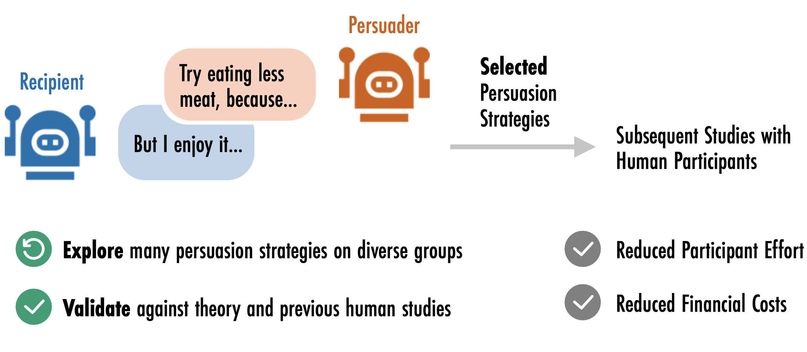

# Simulating Persuasive Dialogues on Meat Reduction with Generative Agents

Authors: Georg Ahnert, Elena Wurth, Markus Strohmaier, and Jutta Mata

Also have a look at our [preprint](https://arxiv.org/abs/2504.04872)



## Abstract

Meat reduction benefits human and planetary health, but social norms keep meat central in shared meals.
To date, the development of _communication strategies that promote meat reduction while minimizing social costs_ has required the costly involvement of human participants at each stage of the process. We present work in progress on simulating multi-round dialogues on meat reduction between _Generative Agents_ based on large language models (LLMs). We measure our main outcome using established psychological questionnaires based on the _Theory of Planned Behavior_ and additionally investigate _Social Costs_. We find evidence that our preliminary simulations produce outcomes that are (i) consistent with theoretical expectations; and (ii) valid when compared to data from previous studies with human participants. Generative agent-based models are a promising tool for identifying novel communication strategies on meat reduction—tailored to highly specific participant groups—to then be tested in subsequent studies with human participants.

---

## Contents
Our simulation setup is based on [AutoGen](https://github.com/microsoft/autogen) but implements custom agents to facilitate additional steps like internal reflection and filling out the questionnaires. We use [vllm](https://docs.vllm.ai/en/stable/) with `automatic prefix caching` to speed up inference.

- `gabm_simulation.py` contains the main simulation setup including all **persona settings** and **prompts**.
- `custom_agents.py` implements our custom generative agents inside the AutoGen framework
- `run_simulation.sh` can be used to first start a `vllm` server and then run the simulation, optionally inside a SLURM environment
- `local_vllm_model.py` extends AutoGen to interface with locally run models that use the OpenAI API specification

In addition to the agent implemention, we also provide our questionnaires and coding schemes under `/questionnaires` and examplary simulation transcripts for `Llama 3.3 70B` under `/results`.

## Getting Started

First, install dependencies with
```bash
conda env create -f environment.yml
```

Then, run the simulation with
```bash
./run_simulation.sh
```
